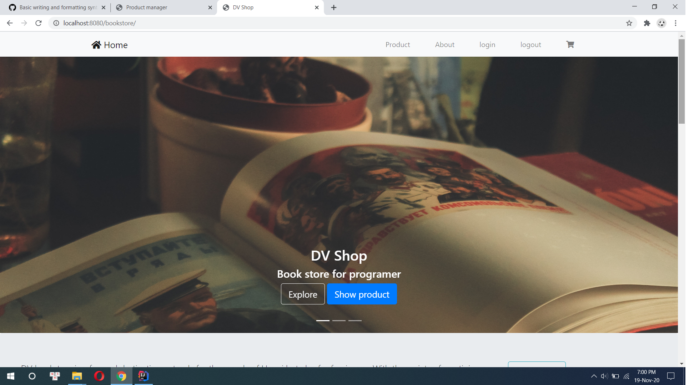
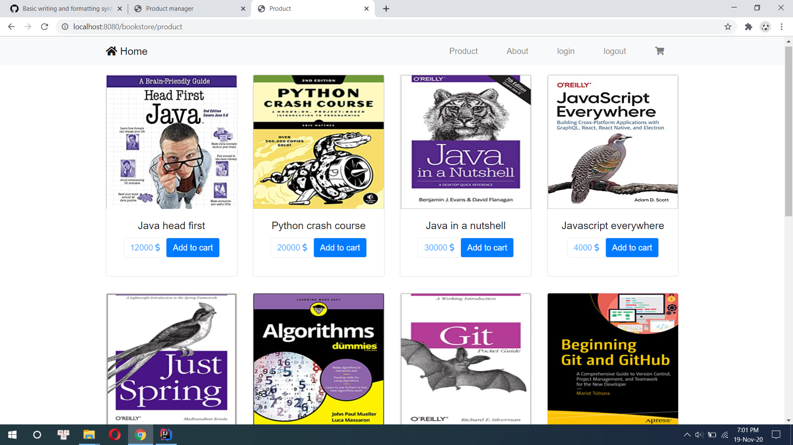
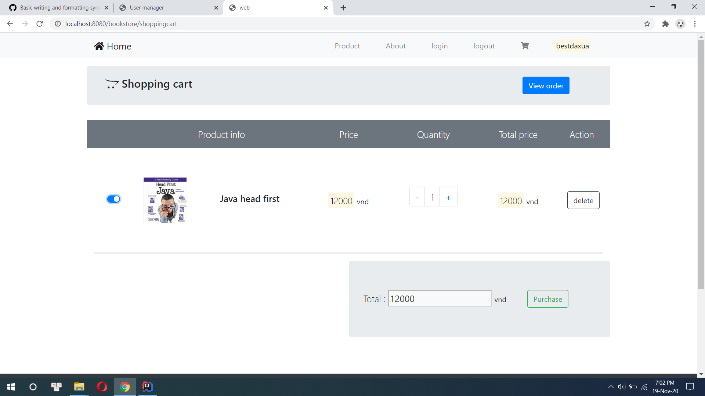
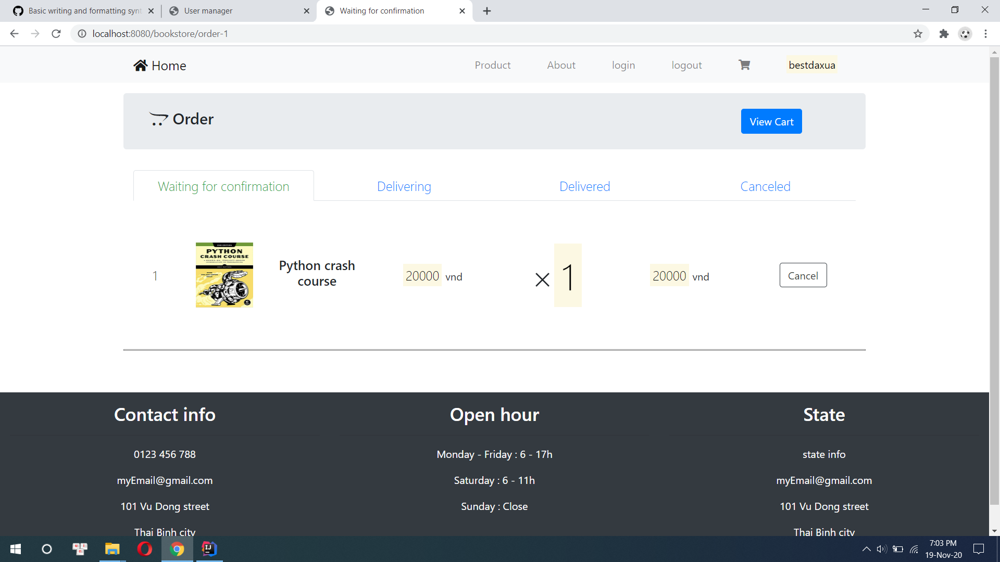
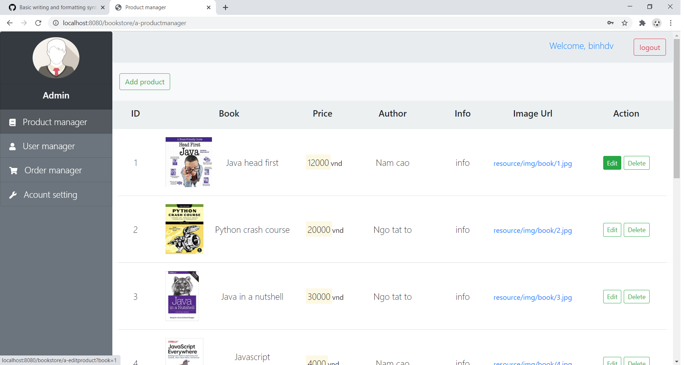

# bookstore

## Description : 
- A e-commerce website that selling programing books for programmer.

## Functionality : 

#### Users : 
- Register, login, logout.
- View, add, delete product from cart.
- Purchase product, view history, order status.

### Administrator
- Admins have their own CMS page.
- Product manager : Add, edit, delete product.
- User manager : Show, edit, delete User account, view user's order history.
- Order manager : Show, confirm, change order status.
- Admin account manager : Change admin account information.

## Technology : 
- Backend : Spring MVC, Hibernate, Microsoft SQL Server 2008.
- Frontend : HTML, CSS Javascript, Bootstrap.
- Tool : [Intellij IDEA](https://www.jetbrains.com/idea/), [VS Code](https://code.visualstudio.com/).

## Version information : 
- Java 8
- Tomcat 8.0.53
- Miscrosoft SQL Server 2008 
- Spring MVC : 5.2.5
- Hibernate : 5.4.10
- See detail in pom.xml file.

## Installation : 
- Import project into IDE.
- Servlet container configure : You should use same version of Tomcat or higher.
- Database configure : Use Microsoft SQL Server, using "sa" account, password "123456"
- Run application.
- Administrator page url : "projectname/administrator"
- Default admin username : "binhdv"
- Default admin password : "123456"
- Feel free to contact me if you got any problem : vanbinhdoan971@gmail.com

## Some final project pictures :
- Index page : 

- Product : 

- Cart : 

- Order status : 

- Administrator CMS page : 

